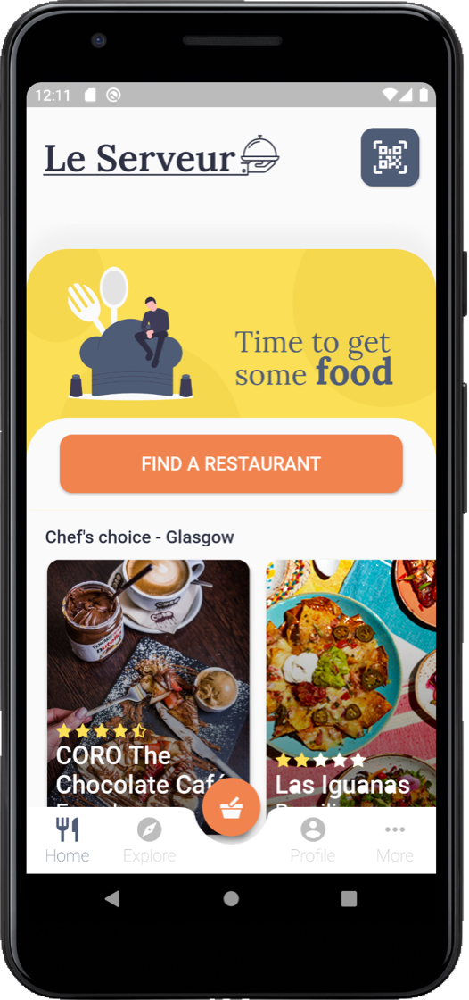

<h1 align="center">
  
  <br>
  <br>
  [COVID-19] Digital Restaurant
  <br>
</h1>

<p align="middle">
  
  
</p>

## Summary

The purpose of this research project was to devise a cross-platform mobile application that reimagined the eating out experience in view of the disruptions caused by the COVID-19 pandemic. The resulting product sought to maximise convenience and, at the same time, facilitate compliance with safety measures imposed by governments around the world. By adopting "Le Serveur", users were able to explore restaurant options, check-in at selected outlets, pick their favourite dishes from food menus, place orders, and express check-out at their preferred time.

## Running the project

Read the instructions below carefully to run the project on your local machine. Please keep in mind that the "Le Serveur" system also encompasses a [backend application](https://github.com/BelfDev/digital-restaurant-api), which must be running locally for the product to work as expected.

### Pre-requisites

| Technology | Minimum Version | Instalation Guide |
|----------------|-----------------|-----------------------------|
|**Flutter** |`v.1.20.3` |[Flutter Official Docs](https://flutter.dev/docs/get-started/install) |
|**Dart** |`v.2.9.2`| *Installed automatically with Flutter* |
|**Git** |`v2.0.0`| [Git Docs](https://git-scm.com/downloads) |
<br>

> Flutter relies on a full installation of Android Studio to supply its Android platform dependencies. However, you can write your Flutter apps in a number of editors.

[Flutter Official Docs](https://flutter.dev/docs/get-started/install) will guide you through configuring your preferred IDE or Code Editor. For this project, the author recommends [Android Studio](https://developer.android.com/studio).

### Step-by-step

Once you have installed all the pre-requisites, please follow the steps below to run the frontend mobile application. You will need to issue a number of commands via your system's Terminal window.

<p align="middle">

</p>

1. **Clone the current repository to a local directory in your machine.**
     - *Copying the repository URL*<br>
    <br>
     - *Navigating to the root directory*<br>
    ```cd ~```<br>
     - *Cloning this repository into the root directory*<br>
    ```git clone https://github.com/BelfDev/digital-restaurant-app.git```<br>
     - *Stepping into the project's directory*<br>
    ```cd digital-restaurant-app```

2. **Open your favorite IDE (e.g. Android Studio).**
3. **Open the project using your favorite IDE.**
     - *Opening a the project using Android Studio*<br>
     ```File > Open > ~/digital-restaurant-app```
4. **Install all project dependencies.** -- *go back to your Terminal window.*
     - *Installing dependencies declared in `pubspec.yaml`*<br>
     ```flutter packages get```
5. **Open the Android or iOS simulator.**
     - *You cannot open the iOS simulator if you are not using a MacOS machine*<br>
     - *Opening the iOS simulator via Android Studio*<br>
     <p align="left">
        
     </p>
6. **Make sure you are running the backend app.**
     - *[Click here](https://github.com/BelfDev/digital-restaurant-api/blob/master/README.md) to learn how to run the API project locally.*<br>
     <br>
7. **Run the app.**
     - *Running the app in DEBUG MODE (Android Studio)*<br>
     ```Run > Debug 'main.dart'```

     <p align="left">
        
     </p>

     - *Or... running the app via the integrated terminal (Android Studio)*<br>
     ```flutter run```

## Final Notes

     - This product was built for research purposes (proof-of-concept); therefore, it should not be launched into production as is.
     - All data displayed in the App are fake -- restaurants and dishes were populated in the database for demonstration purposes.
     - Payment is not integrated with with any payment platforms such as [Adyen](https://www.adyen.com/) or [Stripe](https://stripe.com/).
     - No credit cards are saved.
     - User evaluation results suggested that users find "Le Serveur" useful and easy to use.
     - Elapsed time: 2 months.
